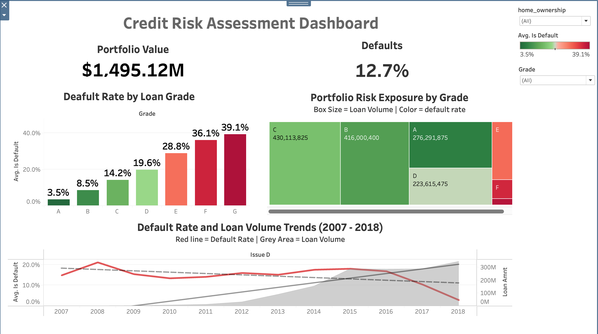
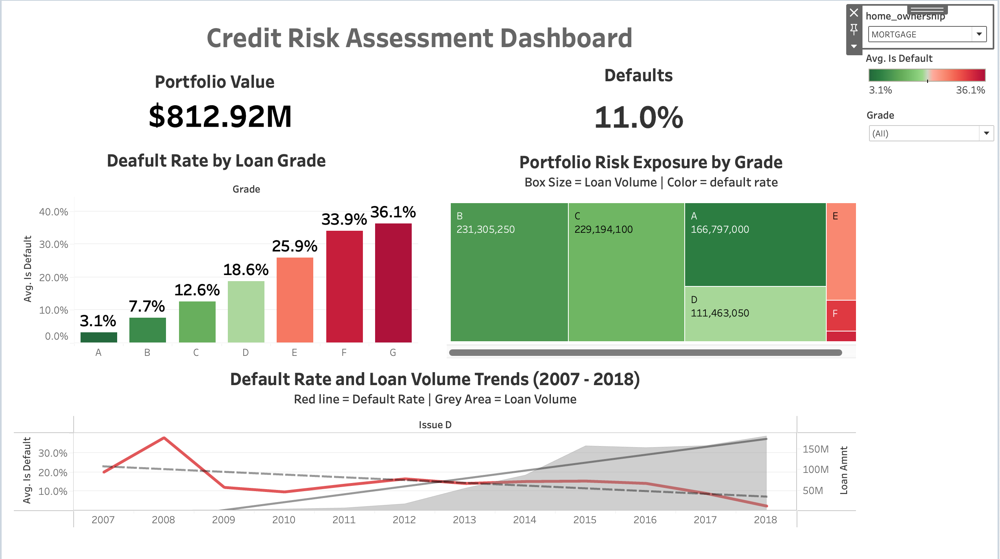
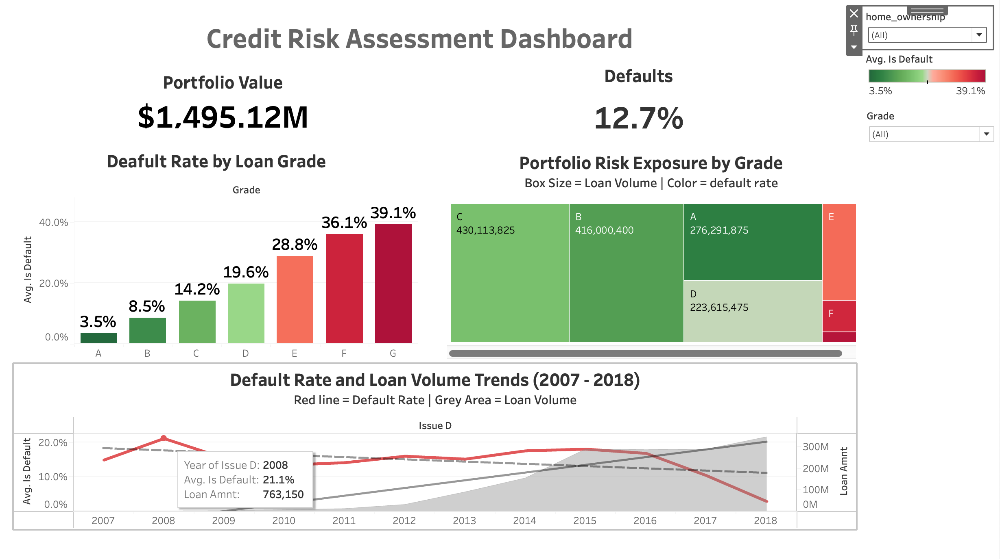
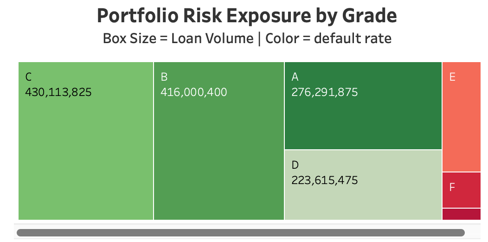
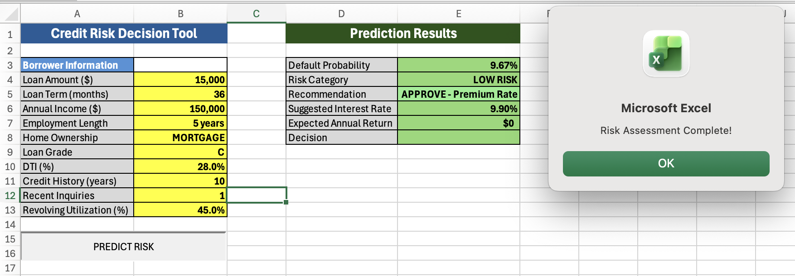

# Credit Risk Assessment System

A comprehensive credit risk modeling system analyzing 2.25 million loans to predict defaults with 73.77% accuracy. Built using machine learning, SQL analytics, Tableau dashboards, and Excel VBA automation to demonstrate end-to-end data analysis capabilities.

## Project Overview

This project addresses a critical business problem: predicting loan defaults before they occur. Using historical data from Lending Club (2007-2018), I built a complete risk assessment system that identifies high-risk borrowers, quantifies portfolio exposure, and provides actionable recommendations.

The analysis revealed that optimizing the decision threshold reduced false loan rejections by 47,832 applications, representing $93.3 million in potential revenue savings.

## Key Findings

**Portfolio Risk Analysis:**
- Total exposure: $33.8 billion across 2.25 million loans
- Expected losses: $4.5 billion (13.3% of portfolio)
- Grade C loans represent 31% of total losses despite only 14% default rate due to massive exposure

**Risk Predictors:**
- Loan grade accounts for 42.6% of prediction importance
- 60-month loans show 60% higher default rates than 36-month loans
- Renters with high debt-to-income ratios default at 22%, regardless of income level

**Historical Trends:**
- 2007-2008 crisis period: 30-40% default rates
- 2015-2018 modern era: 1-2% default rates with improved underwriting

## Technical Implementation

**Machine Learning Pipeline:**
- Trained XGBoost classifier on 1.8 million loans
- Achieved 73.77% accuracy with 0.7330 ROC-AUC score
- Optimized decision threshold to 0.5698 (maximizing F1 score)
- Used SHAP analysis for model interpretability

**SQL Analytics:**
- Created SQLite database with 2.25 million records
- Wrote complex queries using CASE statements, multi-level GROUP BY, and window functions
- Identified high-risk customer profiles through dimensional analysis

**Tableau Dashboard:**
- Built interactive executive dashboard with 5 visualizations
- Portfolio risk treemap showing exposure by grade
- Time-series analysis revealing crisis impacts
- Real-time filtering by grade and home ownership status

**Excel VBA Tool:**
- Automated loan approval decision tool
- One-click risk assessment with color-coded recommendations
- Calculates suggested interest rates and expected profit
- Accessible to non-technical loan officers

## Technology Stack

- **Python**: Data processing, feature engineering, machine learning
- **Libraries**: Pandas, NumPy, Scikit-learn, XGBoost, SHAP, Matplotlib, Seaborn
- **SQL**: SQLite database, SQLAlchemy for Python-SQL integration
- **Tableau**: Interactive dashboards and business intelligence
- **Excel VBA**: Automated decision tool with macro programming
- **Jupyter Notebooks**: Exploratory analysis and documentation

## Project Structure
```
credit-risk-assessment/
├── data/
│   ├── raw/                    # Original Lending Club dataset
│   ├── processed/              # Cleaned data and trained models
│   └── credit_risk.db          # SQLite database
├── notebooks/
│   ├── 01_credit_risk_exploration.ipynb
│   └── 02_sql_analytics.ipynb
├── dashboards/
│   └── Loan_Approval_Tool.xlsm
├── images/                     # Dashboard and tool screenshots
├── sql/
│   └── analysis_queries.sql
└── README.md
```

## Installation and Usage

**Prerequisites:**
- Python 3.8+
- Tableau Public (free)
- Microsoft Excel

## Data Setup

**Download the dataset:**
1. Go to 1. Go to [Lending Club Loan Data on Kaggle](https://www.kaggle.com/datasets/adarshsng/lending-club-loan-data-csv/data)
2. Download `loan.csv` (1.19 GB)
3. Place in `data/raw/` folder

**Create the database:**
Run `01_credit_risk_exploration.ipynb` - Cell 11 automatically creates the SQLite database.

**Setup:**

1. Clone repository
2. Create virtual environment: `python3 -m venv venv`
3. Activate: `source venv/bin/activate`
4. Install dependencies: `pip install -r requirements.txt`
5. Run notebooks in sequence

**Database Access:**
```python
import sqlite3
conn = sqlite3.connect('data/credit_risk.db')
df = pd.read_sql("SELECT * FROM loans LIMIT 1000", conn)
```

## Model Performance

- **Accuracy**: 73.77%
- **ROC-AUC**: 0.7330
- **Precision (Default)**: 25.54%
- **Recall (Default)**: 55.06%
- **F1 Score**: 0.3489
- **Optimal Threshold**: 0.5698

## Business Impact

**Revenue Optimization:**
- Reduced false positives by 47,832 loans
- Estimated revenue impact: $93.3 million

**Risk Recommendations:**
1. Tighten underwriting for Grade C (31% of total losses)
2. Limit or eliminate Grade F/G originations (37-40% default rates)
3. Require income verification for high DTI renters
4. Adjust interest rates based on term length and home ownership

## Screenshots

### Tableau Dashboard

**Executive Overview**

*Complete risk assessment dashboard with KPIs, portfolio analysis, and trend visualization*

**Interactive Filtering**

*Dashboard updates in real-time when filtering by home ownership status*

**2008 Financial Crisis Impact**

*Time-series analysis showing 30%+ default rates during financial crisis period*

**Portfolio Risk Exposure**

*Treemap visualization showing loan exposure by grade (size) and risk level (color)*

### Excel VBA Decision Tool

**Approval Scenario**

*Automated risk assessment recommending loan approval with calculated interest rate*

**Rejection Scenario**

*High-risk applicant automatically flagged for rejection with red warning*

## Future Enhancements

- Deploy XGBoost model as REST API for real-time predictions
- Integrate with loan origination systems
- Add ensemble methods combining multiple models
- Implement automated retraining pipeline
- Expand to include macroeconomic indicators

## Author

**Spandan Surdas**

Data Science Graduate Student at Northeastern University. Background in healthcare machine learning with published research. Previously developed prediction systems at Medtigo achieving 92% accuracy.

- LinkedIn: https://www.linkedin.com/in/s-spandan
- Portfolio: https://spandansurdas.vercel.app/ 
- Email: spandan@northeastern.edu

## License

This project is open source and available under the MIT License.